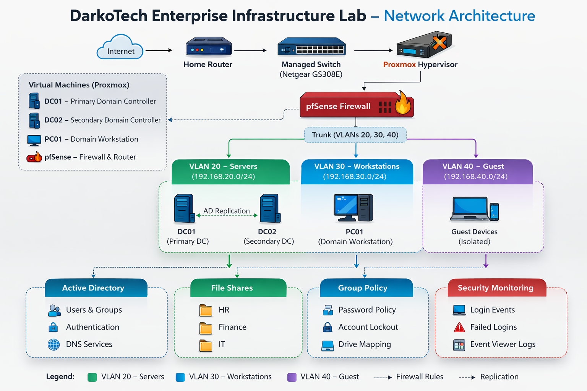
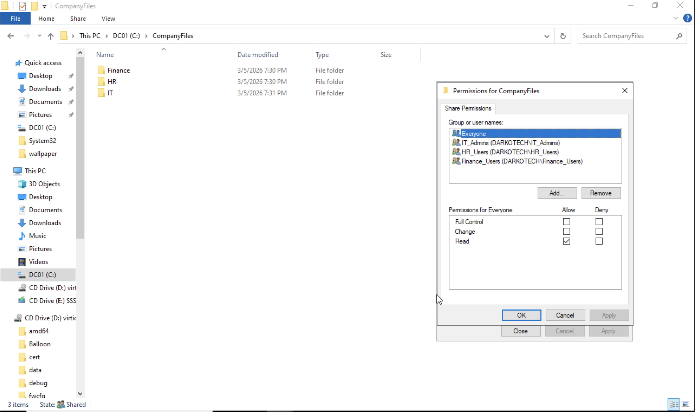
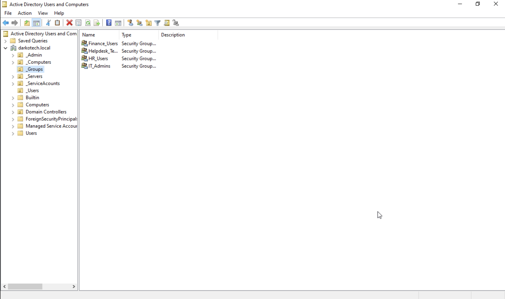
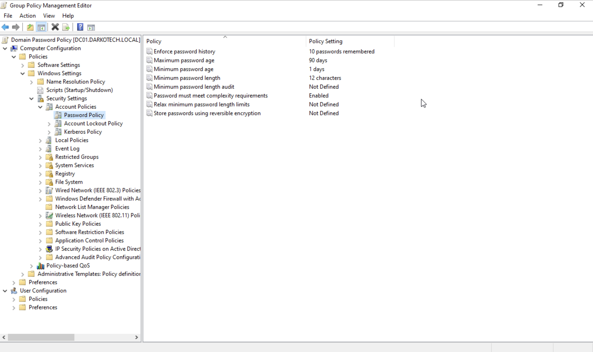

# DarkoTech Enterprise Infrastructure Lab

This project simulates a real-world enterprise IT infrastructure environment using virtualization, firewall security, and Microsoft Active Directory.

The goal of this lab is to build hands-on experience with identity management, network security, access control, and monitoring used in corporate IT environments.

---

## Technologies Used

- Proxmox Virtual Environment (Virtualization)
- pfSense Firewall
- Microsoft Active Directory
- Windows Server
- Windows Workstation
- Managed Network Switch (Netgear GS308E)

---
## Infrastructure Components

| System | Role |
|------|------|
| Proxmox VE | Virtualization platform |
| pfSense | Firewall and router |
| DC01 | Primary Domain Controller |
| DC02 | Secondary Domain Controller |
| PC01 | Domain workstation |
| Ubuntu Server | Linux web server and reverse proxy |
---


## Lab Architecture

The DarkoTech lab simulates a segmented enterprise network environment running on a virtualized infrastructure.

### Network Flow

Internet  
→ Home Router  
→ Managed Switch (Netgear GS308E)  
→ Proxmox Hypervisor  
→ pfSense Firewall  
→ VLAN Segmented Internal Networks
---
## Network Architecture


---
## Network Segmentation

The internal network is segmented using VLANs configured on the pfSense firewall.

| VLAN | Network | Purpose |
|-----|-----|-----|
| VLAN 20 | 192.168.20.0/24 | Infrastructure Servers |
| VLAN 30 | 192.168.30.0/24 | Domain Workstations |
| VLAN 40 | 192.168.40.0/24 | Guest Network |
---
## Proxmox Virtual Environment

The infrastructure runs inside Proxmox VE which hosts the virtual machines used in the lab.

- DC01 (Active Directory Domain Controller)
- PC01 (Domain Workstation)
- pfSense Firewall

### Proxmox Dashboard


---

## Infrastructure Setup

### Virtualization
- Installed Proxmox VE as the hypervisor
- Created multiple virtual machines for infrastructure services
- Configured network bridges for WAN and internal LAN

### Firewall
- Deployed pfSense firewall
- Configured WAN and LAN interfaces
- Enabled DHCP for the internal network
- Verified internet connectivity through firewall routing
## pfSense Firewall

A pfSense firewall was deployed to simulate a corporate network gateway and control traffic between the WAN and internal LAN.

Features configured:

- WAN and LAN interfaces
- Internal LAN network (192.168.1.0/24)
- DHCP services
- Firewall routing between WAN and LAN
- Internet access for internal devices

### pfSense Dashboard


### Active Directory
- Installed Active Directory Domain Services
- Created domain: home.lab
- Configured DNS services
- Joined workstation PC01 to the domain

## Network Segmentation (VLANs)

To simulate an enterprise network architecture, VLAN segmentation was implemented using the pfSense firewall.

| VLAN | Network | Purpose |
|-----|-----|-----|
| 20 | 192.168.20.0/24 | Infrastructure Servers |
| 30 | 192.168.30.0/24 | Domain Workstations |
| 40 | 192.168.40.0/24 | Guest Network |

Each VLAN has dedicated firewall rules to control traffic between network segments.

---

## Access Control

Implemented Role-Based Access Control using security groups.

Security Groups:
- HR_Users
- Finance_Users
- IT_Admins

Shared Folders:
- HR
- Finance
- IT

Configured:
- NTFS permissions
- Share permissions
## Department File Shares

A centralized file share was created on the domain controller to simulate company department storage.

Folder structure:

CompanyFiles
├── HR
├── Finance
└── IT

Access is controlled using Active Directory security groups:

- HR_Users → Access to HR folder
- Finance_Users → Access to Finance folder
- IT_Admins → Administrative access

Both **NTFS permissions** and **Share permissions** were configured to enforce least privilege access.

### Shared Folder Permissions


---
## Active Directory Infrastructure

Active Directory Domain Services was deployed to simulate enterprise identity management.

Domain:
darkotech.local

Domain Controllers:

DC01 – Primary Domain Controller
DC02 – Secondary Domain Controller

Services configured:

Active Directory Domain Services
DNS
Domain authentication
Active Directory replication between controllers

## Active Directory Security Groups

Role-based access control was implemented using Active Directory security groups.

Departments were separated into dedicated groups to control access to resources.

Groups created:

- Finance_Users
- HR_Users
- IT_Admins
- Helpdesk_Team

These groups are used to control permissions on shared folders and systems.

### Active Directory Groups


## Group Policy Automation

Configured Group Policy Objects to enforce organizational security policies.

Password Policy:
- Minimum length: 12
- Complexity: Enabled
- Expiration: 90 days

  ## Password Security Policy

Group Policy was used to enforce strong password policies across the domain.

Configured settings:

- Minimum password length: 12 characters
- Password complexity: Enabled
- Password expiration: 90 days
- Password history: 10 previous passwords remembered
- Minimum password age: 1 day

These settings help protect against brute-force and password reuse attacks.

### Password Policy Configuration



Account Lockout Policy:
- Lock account after 5 failed login attempts

Drive Mapping:
- H: → HR Share
- F: → Finance Share
- I: → IT Share

---

## Security Monitoring

Audit logging was enabled to monitor authentication activity within the domain.

Events monitored:

Successful logins
Failed login attempts
Account lockouts
Policy changes

Logs are reviewed using Windows Event Viewer to detect potential security incidents.

---
## Linux Infrastructure

A Linux server was deployed to simulate modern web infrastructure services.

### Ubuntu Server

An Ubuntu Server VM was deployed inside the Proxmox hypervisor and configured for remote administration.

Features configured:

- SSH remote administration
- Web server hosting
- Reverse proxy configuration
- Log monitoring

### Remote Administration

The server is managed remotely using SSH.

---

### Web Infrastructure

NGINX was deployed as a reverse proxy to route incoming web traffic to backend services.

---

### Log Monitoring

Server activity is monitored using NGINX log files:
/var/log/nginx/access.log
/var/log/nginx/error.log

These logs allow monitoring of:

- incoming web requests
- server errors
- abnormal traffic patterns

### Log Monitoring

Real-time web traffic monitoring was implemented using NGINX access logs.

**Command used**

```bash
sudo tail -f /var/log/nginx/access.log

---


## Skills Demonstrated

This lab demonstrates hands-on experience with:

- Virtualization using Proxmox
- Enterprise firewall configuration with pfSense
- VLAN network segmentation
- Active Directory identity management
- Role-based access control (RBAC)
- Group Policy security management
- Linux server administration
- NGINX reverse proxy configuration
- SSH remote server administration
- Web server hosting
- Log monitoring and troubleshooting

Virtualization with Proxmox
---
## Future Improvements

Planned upgrades for the lab include:

- Infrastructure monitoring using Prometheus
- Grafana dashboards for system metrics
- Kali Linux security testing environment
- Centralized logging and SIEM tools
- Secure DMZ network for public services
