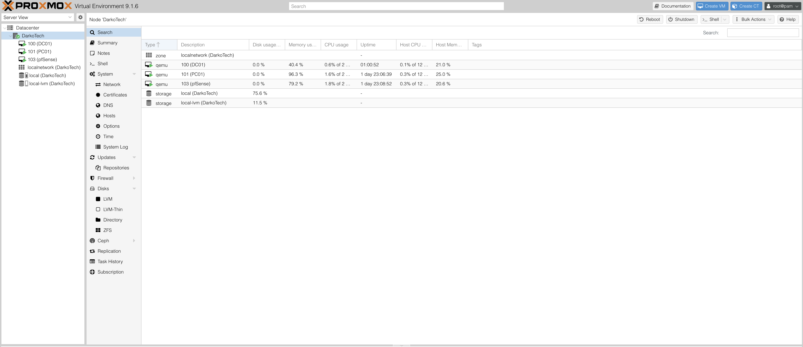
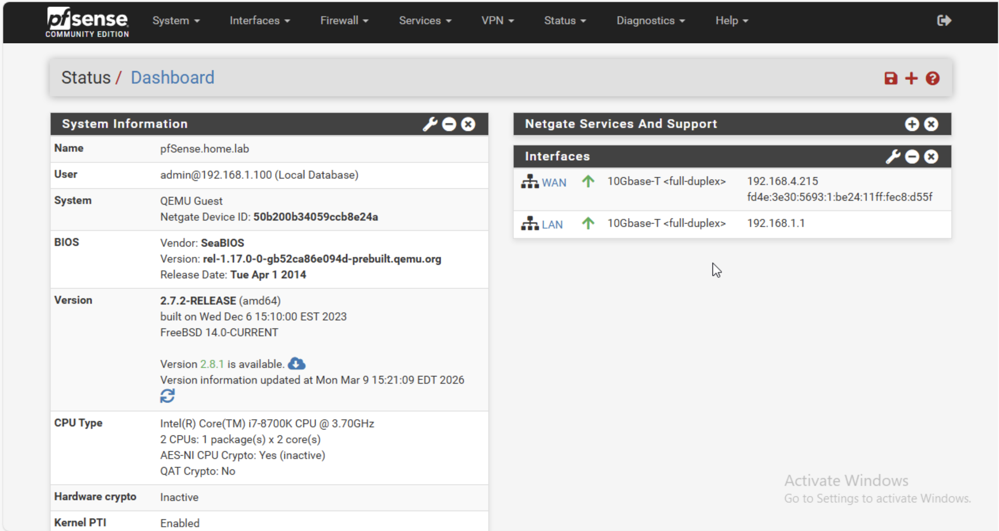

# DarkoTech Enterprise Infrastructure Lab

This project simulates a real-world enterprise IT infrastructure environment using virtualization, firewall security, and Microsoft Active Directory.

The goal of this lab is to build hands-on experience with identity management, network security, access control, and monitoring used in corporate IT environments.

---

## Technologies Used

- Proxmox Virtual Environment (Virtualization)
- pfSense Firewall
- Microsoft Active Directory
- Windows Server
- Windows Workstation
- Managed Network Switch (Netgear GS308E)

---

## Lab Architecture

Internet
   │
Home Router
   │
Managed Switch
   │
Proxmox Hypervisor
   │
pfSense Firewall
   │
LAN (192.168.1.0/24)
   │
├── DC01 (Active Directory + DNS)
└── PC01 (Domain Workstation)
## Proxmox Virtual Environment

The infrastructure runs inside Proxmox VE which hosts the virtual machines used in the lab.

- DC01 (Active Directory Domain Controller)
- PC01 (Domain Workstation)
- pfSense Firewall

### Proxmox Dashboard

---

## Infrastructure Setup

### Virtualization
- Installed Proxmox VE as the hypervisor
- Created multiple virtual machines for infrastructure services
- Configured network bridges for WAN and internal LAN

### Firewall
- Deployed pfSense firewall
- Configured WAN and LAN interfaces
- Enabled DHCP for the internal network
- Verified internet connectivity through firewall routing
## pfSense Firewall

A pfSense firewall was deployed to simulate a corporate network gateway and control traffic between the WAN and internal LAN.

Features configured:

- WAN and LAN interfaces
- Internal LAN network (192.168.1.0/24)
- DHCP services
- Firewall routing between WAN and LAN
- Internet access for internal devices

### pfSense Dashboard

### Active Directory
- Installed Active Directory Domain Services
- Created domain: home.lab
- Configured DNS services
- Joined workstation PC01 to the domain

---

## Access Control

Implemented Role-Based Access Control using security groups.

Security Groups:
- HR_Users
- Finance_Users
- IT_Admins

Shared Folders:
- HR
- Finance
- IT

Configured:
- NTFS permissions
- Share permissions

---

## Group Policy Automation

Configured Group Policy Objects to enforce organizational security policies.

Password Policy:
- Minimum length: 12
- Complexity: Enabled
- Expiration: 90 days

Account Lockout Policy:
- Lock account after 5 failed login attempts

Drive Mapping:
- H: → HR Share
- F: → Finance Share
- I: → IT Share

---

## Security Monitoring

Enabled auditing for:

- Login events
- Failed login attempts
- Account lockouts
- Policy changes

Monitoring performed using Windows Event Viewer.

---

## Future Improvements

Planned upgrades to the lab environment include:

- VLAN network segmentation
- Additional servers
- Monitoring dashboards
- Security attack simulations
